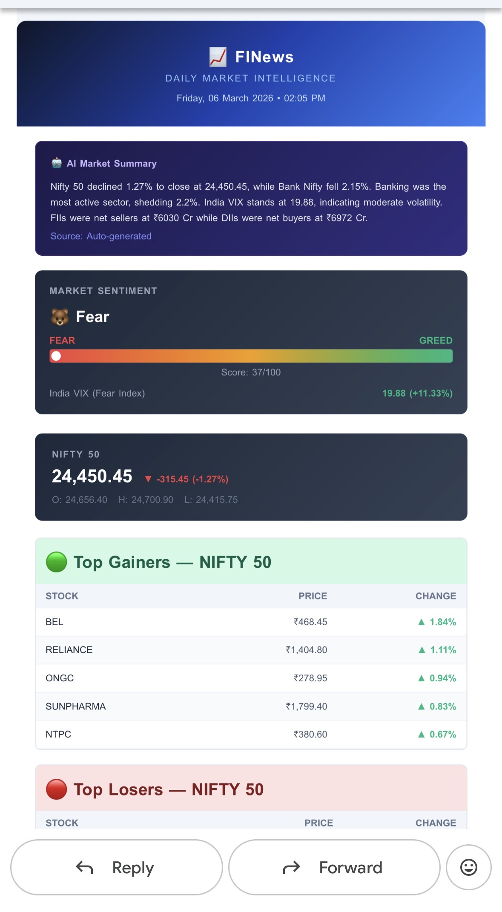
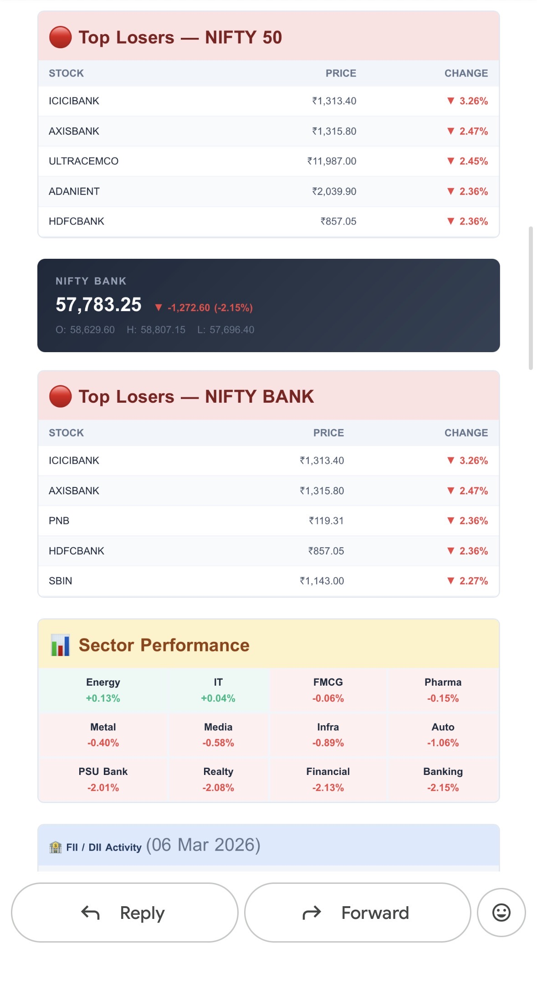
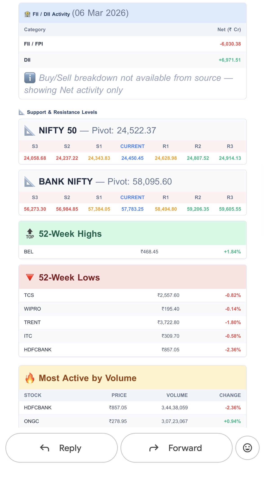
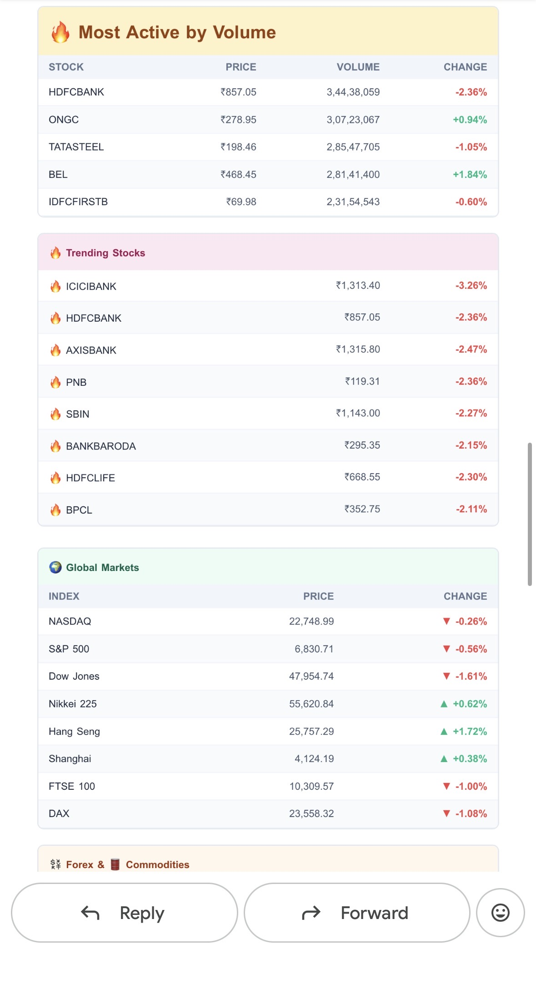
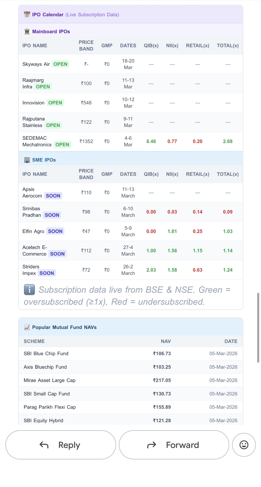
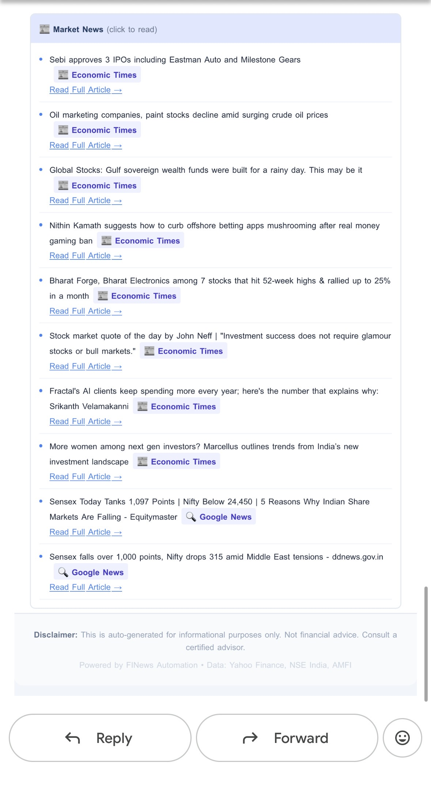
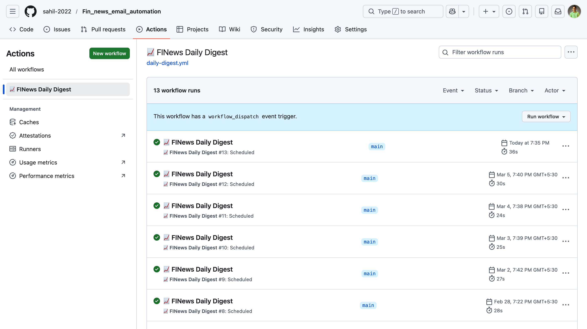

<div align="center">

# 📈 FINews — Stock Market Intelligence Automation

**Automated daily stock market digest delivered straight to your inbox.**


*Collects real-time market data • Generates actionable insights • Delivers a beautiful HTML email report — fully automated via GitHub Actions.*

---

</div>

## 🧭 Table of Contents

- [Project Overview](#-project-overview)
- [Problem Statement](#-problem-statement)
- [Features](#-features)
- [How It Works](#-how-it-works)
- [System Architecture](#-system-architecture)
- [Tech Stack](#-tech-stack)
- [Automation Workflow (GitHub Actions)](#-automation-workflow-github-actions)
- [Example Output](#-example-output)
- [Project Structure](#-project-structure)
- [How to Run Locally](#-how-to-run-locally)
- [Future Improvements](#-future-improvements)
- [Author](#-author)

---

## 📖 Project Overview

**FINews** is an end-to-end automated stock market intelligence system built with Node.js and powered by GitHub Actions. Every trading day at **7:00 PM IST**, the system:

1. Scrapes and collects data from multiple financial sources  
2. Processes **14+ market intelligence features**  
3. Generates a rich, responsive HTML email report  
4. Delivers it automatically to configured recipients  

No manual intervention needed — it runs entirely in the cloud.

---

## 🎯 Problem Statement

Retail investors and market enthusiasts spend **hours daily** sifting through multiple websites, apps, and platforms to gather scattered market information. Key pain points include:

- **Information overload** — too many sources, too little time  
- **Missed signals** — important data points buried across platforms (FII/DII flows, sector rotations, VIX changes)  
- **No single dashboard** — Nifty, Bank Nifty, global cues, forex, and commodities are tracked in silos  
- **Repetitive manual effort** — same checks, same websites, every single day  

**FINews solves this** by automating the entire data collection, processing, and delivery pipeline into one comprehensive daily email digest — so you can focus on decision-making, not data-gathering.

---

## ✨ Features

| # | Feature | Description |
|---|---------|-------------|
| 1 | **Nifty 50 & Bank Nifty** | Live index values, daily change, percentage movement |
| 2 | **Top Gainers & Losers** | Stocks with the highest gains and deepest losses |
| 3 | **FII/DII Activity** | Foreign & Domestic Institutional Investor buy/sell data |
| 4 | **Sector Performance** | Sectoral indices (IT, Pharma, Auto, Energy, etc.) |
| 5 | **India VIX** | Volatility index — fear gauge of the market |
| 6 | **Market Sentiment** | Composite sentiment score (Bullish / Bearish / Neutral) |
| 7 | **Global Markets** | S&P 500, Dow Jones, NASDAQ, FTSE, Nikkei, Hang Seng |
| 8 | **Forex Rates** | USD/INR, EUR/INR, GBP/INR |
| 9 | **Commodity Prices** | Gold, Silver, Crude Oil |
| 10 | **Support & Resistance** | Key technical levels for Nifty & Bank Nifty |
| 11 | **Trending Stocks** | Stocks with unusual volume or momentum |
| 12 | **IPO Calendar** | Upcoming and active IPOs (Mainboard & SME) |
| 13 | **Earnings Calendar** | Companies reporting quarterly results |
| 14 | **Mutual Fund NAVs** | NAV tracking for popular mutual funds |
| 15 | **52-Week Highs & Lows** | Stocks hitting yearly extremes |
| 16 | **Most Active by Volume** | Top traded stocks by volume |
| 17 | **AI-Powered Summary** | Auto-generated market narrative & outlook |
| 18 | **Market News** | Latest headlines from financial news sources |

---

## ⚙️ How It Works

The pipeline runs in **4 sequential phases**, with each phase executing tasks in parallel for maximum speed:

```
Phase 1 → Core Data         Nifty/BankNifty, FII/DII, Market News
Phase 2 → Enhanced Data     Sectors, VIX, Global Markets, Forex, Commodities
Phase 3 → Advanced Data     Support/Resistance, Trending, IPOs, Earnings, MF NAVs
Phase 4 → AI Summary        Auto-generated market narrative from collected data
         ↓
     HTML Email Generation → Email Delivery via Nodemailer
```

All phases use `Promise.allSettled()` for fault-tolerant execution — if one data source fails, the rest continue unaffected.

---

## 🏗️ System Architecture

```
┌──────────────────────────────────────────────────────────────────┐
│                     GitHub Actions (Cron)                        │
│                  Triggers daily at 7:00 PM IST                  │
└─────────────────────────┬────────────────────────────────────────┘
                          │
                          ▼
┌──────────────────────────────────────────────────────────────────┐
│                    📡 Data Collection Layer                      │
│                                                                  │
│  ┌──────────────┐  ┌──────────────┐  ┌──────────────────────┐   │
│  │  marketData   │  │  fiiDiiData   │  │     newsData         │   │
│  │  (Yahoo Fin.) │  │  (Web Scrape) │  │  (News Scrape)       │   │
│  └──────────────┘  └──────────────┘  └──────────────────────┘   │
│  ┌──────────────┐  ┌──────────────┐  ┌──────────────────────┐   │
│  │ enhancedData  │  │ advancedData  │  │   AI Summary Gen.    │   │
│  │ (Sectors,VIX) │  │ (IPO,Earnings)│  │  (Rule-based/AI)     │   │
│  └──────────────┘  └──────────────┘  └──────────────────────┘   │
└─────────────────────────┬────────────────────────────────────────┘
                          │
                          ▼
┌──────────────────────────────────────────────────────────────────┐
│                  🔄 Processing & Insights                        │
│                                                                  │
│     Sentiment Analysis • 52-Week Breakouts • Volume Leaders      │
│           Technical Levels • Trend Detection                     │
└─────────────────────────┬────────────────────────────────────────┘
                          │
                          ▼
┌──────────────────────────────────────────────────────────────────┐
│                   📧 Email Generation                            │
│                                                                  │
│  ┌──────────────────┐    ┌──────────────────────────────────┐   │
│  │  template.js      │───▶│  Responsive HTML Email Report    │   │
│  │  (HTML Generator) │    │  (Dark theme, mobile-friendly)   │   │
│  └──────────────────┘    └──────────────────────────────────┘   │
└─────────────────────────┬────────────────────────────────────────┘
                          │
                          ▼
┌──────────────────────────────────────────────────────────────────┐
│                   📬 Email Delivery                              │
│                                                                  │
│          Nodemailer → Gmail SMTP → Recipients Inbox              │
└──────────────────────────────────────────────────────────────────┘
```

---

## 🛠️ Tech Stack

| Category | Technology |
|----------|-----------|
| **Runtime** | Node.js 22 |
| **HTTP Client** | Axios |
| **Web Scraping** | Cheerio |
| **Financial Data** | Yahoo Finance 2 API |
| **Email** | Nodemailer (Gmail SMTP) |
| **HTML Templating** | Custom JS template engine |
| **Scheduling** | node-cron (local) / GitHub Actions (cloud) |
| **Web Dashboard** | Express.js + Vanilla HTML/CSS/JS |
| **CI/CD** | GitHub Actions |
| **Time Utilities** | date-fns, date-fns-tz |

---

## 🤖 Automation Workflow (GitHub Actions)

The project uses a GitHub Actions workflow (`.github/workflows/daily-digest.yml`) to run the digest automatically:

```yaml
name: 📈 FINews Daily Digest

on:
  schedule:
    # 7:00 PM IST = 1:30 PM UTC (Monday - Saturday)
    - cron: '30 13 * * 1-6'
  workflow_dispatch: # Manual trigger via GitHub UI

jobs:
  send-digest:
    runs-on: ubuntu-latest
    steps:
      - uses: actions/checkout@v4
      - uses: actions/setup-node@v4
        with:
          node-version: '22'
      - run: npm install
      - run: node src/index.js --now
        env:
          EMAIL_USER: ${{ secrets.EMAIL_USER }}
          EMAIL_PASS: ${{ secrets.EMAIL_PASS }}
          EMAIL_TO: ${{ secrets.EMAIL_TO }}
```

### Required GitHub Secrets

| Secret | Description |
|--------|-------------|
| `EMAIL_USER` | Gmail address used to send the email |
| `EMAIL_PASS` | Gmail App Password ([Generate here](https://myaccount.google.com/apppasswords)) |
| `EMAIL_TO` | Recipient email(s) — comma-separated for multiple |

---

## 📸 Example Output

### Email Report
> A comprehensive, dark-themed HTML email with all market data sections.

| | |
|:---:|:---:|
|  |  |
|  |  |
|  |  |

### GitHub Actions Workflow
> Automated pipeline running daily on GitHub's infrastructure.

<p align="center">
  
</p>

---

## 📁 Project Structure

```
FINews/
├── .github/
│   └── workflows/
│       └── daily-digest.yml        # GitHub Actions cron workflow
├── src/
│   ├── scrapers/
│   │   ├── marketData.js            # Nifty 50, Bank Nifty, top gainers/losers
│   │   ├── fiiDiiData.js            # FII/DII buy/sell activity
│   │   ├── newsData.js              # Market news headlines
│   │   ├── enhancedData.js          # Sectors, VIX, global markets, forex, commodities
│   │   └── advancedData.js          # Support/resistance, IPOs, earnings, MF NAVs, AI summary
│   ├── email/
│   │   ├── template.js              # HTML email template generator
│   │   └── sender.js                # Nodemailer email sending logic
│   ├── public/
│   │   ├── index.html               # Web dashboard UI
│   │   ├── app.js                   # Dashboard frontend logic
│   │   └── style.css                # Dashboard styles
│   ├── index.js                     # Main pipeline orchestrator (14 features)
│   ├── scheduler.js                 # Local cron scheduler (node-cron)
│   └── server.js                    # Express server for web dashboard
├── images/                          # Screenshots and diagrams
├── .env.example                     # Environment variable template
├── .gitignore
├── package.json
└── README.md
```

---

## 🚀 How to Run Locally

### Prerequisites

- **Node.js 22+** installed ([Download](https://nodejs.org/))
- **Gmail account** with [App Password](https://myaccount.google.com/apppasswords) enabled

### 1. Clone the Repository

```bash
git clone https://github.com/your-username/Fin_news_email_automation.git
cd Fin_news_email_automation
```

### 2. Install Dependencies

```bash
npm install
```

### 3. Configure Environment Variables

```bash
cp .env.example .env
```

Edit `.env` with your credentials:

```env
EMAIL_USER=your-email@gmail.com
EMAIL_PASS=your-gmail-app-password
EMAIL_TO=recipient@gmail.com
```

### 4. Send a Test Email

```bash
npm run send-now
```

### 5. Start the Local Scheduler (Optional)

```bash
npm start
```

This will use `node-cron` to schedule the digest locally at **7:00 PM IST** every day.

### 6. Launch Web Dashboard (Optional)

```bash
npm run dashboard
```

Open `http://localhost:3000` to view the market dashboard.

---

## 🔮 Future Improvements

- [ ] **WhatsApp / Telegram Integration** — Deliver digest via messaging apps  
- [ ] **Personalized Watchlists** — Customized stock alerts per subscriber  
- [ ] **Historical Data Tracking** — Store daily data for trend analysis  
- [ ] **Interactive Web Dashboard** — Real-time charts and analytics  
- [ ] **Options Chain Analysis** — Put/Call ratios, OI data, max pain  
- [ ] **Multi-language Support** — Hindi, Marathi, and other regional translations  
- [ ] **SMS Alerts** — Critical market movement notifications  
- [ ] **Portfolio Tracking** — Track personal holdings against market performance  
- [ ] **RSS Feed** — Subscribe via RSS reader  
- [ ] **PDF Report Generation** — Downloadable market reports  

---

## 👤 Author

Built with ❤️ for the Indian stock market community.

**Sahil Prajapati**  
- GitHub: [@sahilprajapati](https://github.com/sahilprajapati)

---

<div align="center">

⭐ **If you find this project useful, please consider giving it a star!** ⭐

</div>
